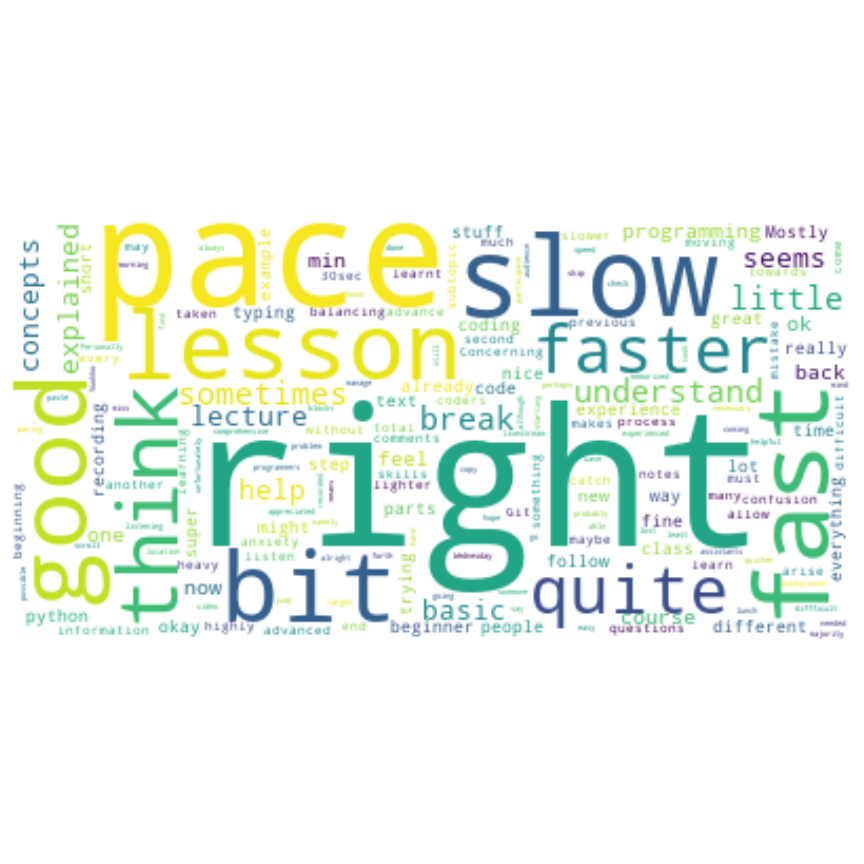
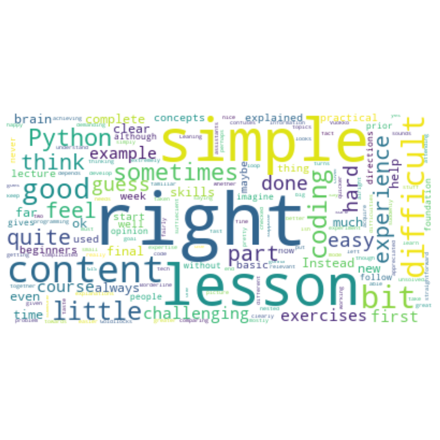

# feedback-summary

Summarizing the mid-term feedback for Geo-Python 2019. 

## Overview
- All in all the mid-term feedback was very positive!
- Lesson videos and exercises get many thanks 
- Many students are eagerly wainting for the "GIS stuff" - we will dive into GIS processes during Period 2! :)
- Pace of the lessons seems to be mostly ok. For some of the students (those who have done programming before), the pace is too slow, and for some of the students the pace is borderline too fast.
- Spesific lessons, such as the Git lesson would require more time, and a different approach! 
- Some of the students find the first lessons (too) simple.
- There is still some confusion with all the environments we are using (webpages, CSC, Jupyter Lab etc.)

## General reply to the feedback
- thanks for all the positive feedback and useful suggestions! We are continuously developing the course forwards
- this is a beginner level course, that forms the basis for more advanced content in period 2. We are taking things (rather) easy during the first weeks so that no one would be left behind. 
- Of course, we hope to provide useful content and enough challenge for those who already have some programming experience :) 

# Wordclouds!
In stead of highlighting individual quotes from the feedback, we tested how the feedback would look like as wordclouds :D 
A wordcloud summarizes a bunch of text, calculates word frequencies. The more popular the word, the bigger the text in the word cloud.

Word cloud plots in this notebook are based on this tutorial: https://www.datacamp.com/community/tutorials/wordcloud-python

## Q1: 'Is the pace of the lessons too fast, too slow, or about right?'

## Q2: 'Is the content of the lessons too simple, too difficult, or about right?'

